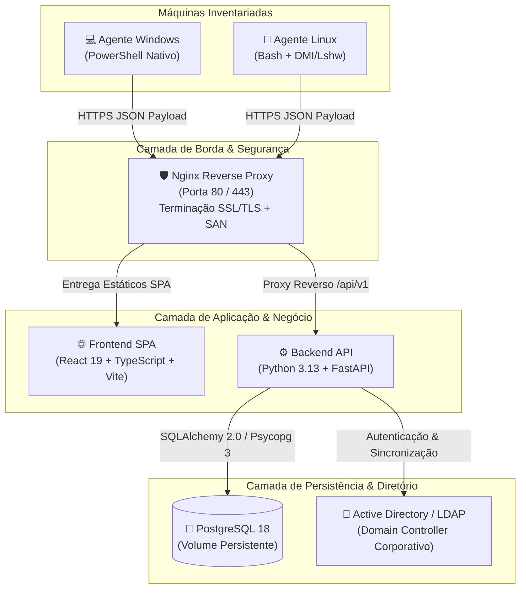

# 📘 Documentação Técnica e Arquitetura do Sistema de Inventário

---

## 1. Visão Geral Executiva

O **Sistema de Inventário Corporativo** é uma solução completa, centralizada e de alta performance para **gestão, governança e auditoria de ativos de TI (estações de trabalho, servidores e notebooks)** em redes corporativas distribuídas.

Projetada com arquitetura moderna, escalável e *cloud-native*, a plataforma atende desde empresas de pequeno porte até grandes redes com matriz e dezenas de filiais/lojas, permitindo:

* **Visibilidade em Tempo Real:** Monitoramento do parque de máquinas (Windows e Linux) com dados precisos de hardware, armazenamento, rede, sistema operacional e softwares instalados.
* **Auditoria de Hardware Drift (Troca de Peças):** Registro histórico automatizado de qualquer alteração de hardware (remoção ou adição de memória RAM, substituição de processador, troca de placa-mãe ou serial).
* **Gestão e Prevenção de Espaço em Disco:** Monitoramento com alertas visuais para discos com uso acima de 75% e análise detalhada das pastas de usuários que mais consomem armazenamento.
* **Auditoria de Licenças e Softwares:** Catálogo consolidado de pacotes, aplicativos e versões instaladas em toda a empresa, auxiliando na conformidade e segurança da informação.
* **Implantação Zero-Touch:** Agentes nativos e leves que podem ser distribuídos via script de linha de comando única, agendados no Cron (Linux) ou via GPO / Agendador de Tarefas (Windows).
* **Integração Nativa com Active Directory:** Autenticação unificada LDAP/LDAPS com provisionamento automático de usuários (*Just-In-Time*) e vinculação por grupos do AD.

---

## 2. Diagrama de Arquitetura



---

## 3. Stack Tecnológica Detalhada

| Camada | Tecnologia | Versão | Justificativa e Responsabilidade |
| :--- | :--- | :--- | :--- |
| **Frontend** | React + TypeScript | 19.x / 5.x | Interface reativa, tipada e com zero dependências externas pesadas. |
| **Build Frontend** | Vite | 6.x | Compilação ultra-rápida (100ms) e geração de bundle otimizado (< 100 KB gzipped). |
| **Estilização** | Vanilla CSS Modular | CSS3 Moderno | Design System exclusivo, temas harmoniosos, sem dependência de frameworks inflados (Tailwind/Bootstrap). |
| **Backend API** | Python / FastAPI | 3.13 / 0.115+ | Framework assíncrono de altíssimo throughput, documentação Swagger/OpenAPI automática e tipagem estrita via Pydantic v2. |
| **ORM & Migrações** | SQLAlchemy / Alembic | 2.0+ / 1.14+ | Modelagem relacional orientada a objetos com versionamento seguro e rastreável de esquemas de banco de dados. |
| **Driver PostgreSQL** | Psycopg 3 | 3.2+ | Conector PostgreSQL de última geração, com suporte nativo a tipos binários e alta performance. |
| **Banco de Dados** | PostgreSQL | 18 | Banco de dados relacional robusto, com conformidade ACID completa, integridade referencial e suporte a JSONB. |
| **Proxy Reverso / Web** | Nginx | 1.27 Alpine | Servidor web leve, terminação SSL/TLS com fallback auto-assinado SAN, mitigação de vulnerabilidades e roteamento SPA. |
| **Orquestração** | Docker / Compose | v2+ | Isolamento de dependências, portabilidade multiplataforma e deploys reproduzíveis. |
| **Agente Windows** | PowerShell | 5.1+ / 7.x | Coleta nativa via CIM/WMI e Registro, sem necessidade de instalar executáveis terceiros nas máquinas clientes. |
| **Agente Linux** | POSIX Bash | 4.x / 5.x | Coleta via ferramentas nativas (`/proc`, `dmidecode`, `lsblk`, `apt-mark`), compatível com Debian, Ubuntu, Zorin, etc. |

---

## 4. Detalhamento dos Módulos Principais

### 4.1. Painel de Inventário e Estatísticas
* **Cards de Indicadores (KPIs):** Visão instantânea da quantidade total de equipamentos, máquinas operacionais (OK), estações recomendadas para upgrade (disco > 75% ou menos de 8 GB de RAM) e máquinas sem comunicação recente.
* **Filtros Dinâmicos Combinados:** Filtragem por plataforma (Windows/Linux), por filial/loja com contagem adaptativa, e busca universal (Hostname, IP, MAC, Serial, Processador ou Usuário).
* **Exportação Executiva:** Exportação de toda a visão filtrada em formato CSV formatado em UTF-8 com suporte nativo para abertura direta no Microsoft Excel.

### 4.2. Auditoria e Rastreamento de Hardware Drift
* **Detecção Automática:** Sempre que uma máquina envia seus dados, o backend compara os dados atuais de CPU, RAM e Placa-Mãe com a coleta anterior.
* **Registro de Histórico (`device_history`):** Qualquer discrepância (ex: máquina tinha 16 GB de RAM e agora reporta 8 GB) é registrada com data/hora, valor anterior e novo valor.
* **Alerta Visual e Ação Corretiva:** A máquina ganha um distintivo visual de alerta no painel, permitindo ao administrador auditar o histórico e clicar em "Limpar Alerta" após conferência física.

### 4.3. Análise Detalhada de Uso de Disco
* **Decomposição por Pastas:** O agente calcula o consumo total das pastas de perfis de usuários em disco (`C:\Users\*` no Windows e `/home/*` no Linux).
* **Interface Hierárquica:** Abertura em árvore mostrando quais contas locais estão sobrecarregando a unidade de armazenamento.

### 4.4. Catálogo de Softwares e Pacotes
* **Visão Agrupada:** Módulo dedicado que totaliza todos os softwares instalados na infraestrutura.
* **Classificação Inteligente:** Separação automática entre Aplicativos de Usuário, Agentes de Monitoramento/Suporte, Runtimes (Java, .NET, Python) e Ferramentas de Sistema.
* **Rastreamento Reverso:** Ao clicar em qualquer software ou versão, o sistema exibe instantaneamente todas as máquinas da empresa que possuem aquele programa instalado.

### 4.5. Autenticação e Integração com Active Directory (LDAP/LDAPS)
* **Login Unificado:** Suporte tanto a usuários locais do banco de dados quanto a credenciais corporativas do domínio Windows (Active Directory).
* **Provisionamento Just-in-Time (JIT):** Ao realizar o primeiro login com sucesso no AD, o usuário é cadastrado automaticamente no PostgreSQL com seu nome completo e e-mail.
* **Mapeamento de Grupos:** Grupos de segurança do AD podem ser vinculados a lojas específicas ou ao perfil de Superadministrador global.

### 4.6. Central de Distribuição de Agentes
* **Endpoints Dinâmicos:** A API distribui os agentes nos caminhos `/api/v1/agent/windows` e `/api/v1/agent/linux` pré-configurados com a URL exata do servidor a partir dos cabeçalhos HTTP da requisição.
* **Agendamento Prático:** O modal de ajuda do painel fornece comandos prontos para cópia com um clique, facilitando a automação via GPO ou scripts em massa.

---

## 5. Camadas de Segurança da Aplicação

### 5.1. Proteção de Credenciais e Autenticação
* **Assinatura JWT (JSON Web Tokens):** Tokens de acesso gerados com algoritmo `HS256` utilizando chave secreta de alta entropia (256 bits) gerada aleatoriamente na instalação.
* **Criptografia de Senhas:** Senhas locais são protegidas com algoritmos modernos de dispersão unidirecional (Bcrypt / Argon2), impossibilitando a recuperação em caso de acesso indevido à base de dados.
* **Sessões Seguras e Resilientes:** Validação de cabeçalho `Authorization: Bearer <token>` em todos os endpoints privados, com tratamento de reconexão transparente no frontend contra quedas transitórias de rede.

### 5.2. Controle de Acesso Baseado em Perfis (RBAC - Role-Based Access Control)
O sistema possui 3 perfis nativos de acesso:
1. **Super Administrador:** Acesso irrestrito a configurações globais, integrações do Active Directory, cadastro de lojas e exclusão de máquinas.
2. **Administrador:** Gestão de inventário e visualização de relatórios de filiais permitidas.
3. **Operador:** Visualização operacional do inventário de sua filial de atuação.

### 5.3. Segurança de Rede e Proxy Reverso (Nginx)
* **Redirecionamento Forçado HTTP -> HTTPS:** Nenhuma requisição trafega em texto claro; todas as conexões na porta 80 são automaticamente redirecionadas para a porta 443 com código HTTP 301.
* **Ocultação de Assinatura (`server_tokens off`):** O Nginx omite o número de versão nos cabeçalhos de resposta, mitigando ataques de reconhecimento automatizados.
* **Certificados SSL com Extensão SAN (Subject Alternative Name):** O gerador automático de certificados inclui o IP e DNS do servidor no campo SAN, atendendo aos requisitos modernos de segurança do Google Chrome, Mozilla Firefox e PowerShell.

### 5.4. Proteção contra Injeção e Sanitização de Dados
* **SQL Injection:** Todas as operações com banco de dados utilizam o SQLAlchemy ORM com consultas parametrizadas obrigatórias.
* **Command Injection:** Os agentes de coleta executam apenas comandos internos do sistema operacional através de caminhos fechados e tratam variáveis com aspas duplas e escape de caracteres.

---

## 6. Otimizações de Desempenho e Eficiência

### 6.1. Agentes Inteligentes com Delta Hashing
Para evitar tráfego de rede e processamento inútil no servidor, os agentes Windows e Linux implementam controle de versão local:
1. A coleta gera o JSON da máquina.
2. É calculado o hash criptográfico MD5 excluindo o timestamp.
3. Se o hash for idêntico ao da coleta anterior, **o envio pela rede é cancelado**, reportando que a máquina permanece no mesmo estado.
4. Caso haja instalação de software ou troca de hardware, o hash muda e o envio é realizado imediatamente.

### 6.2. Conexões e Consultas ao Banco de Dados
* **Connection Pooling:** O SQLAlchemy mantém um pool de conexões reutilizáveis com `pool_pre_ping=True`, descartando conexões inativas antes que causem erros na aplicação.
* **Índices Estruturais:** Tabelas críticas possuem índices compostos (ex: `company_id + hostname`, `company_id + site_id`, `mac`, `data_alteracao`), garantindo respostas em milissegundos mesmo com dezenas de milhares de registros.

### 6.3. Frontend Ultra-Rápido e Zero Layout Shift
* **Bundle Otimizado:** Build de produção compactado em menos de 100 KB gzipped.
* **Zero CLS (Cumulative Layout Shift):** O sistema de notificações flutuantes (toasts) utiliza coordenadas fixas no viewport, garantindo que o surgimento de mensagens nunca empurre ou quebre o layout das tabelas.

---

## 7. Confiabilidade e Resiliência Operacional

* **Auto-Recuperação de Serviços:** Todos os containers no `docker-compose.yml` utilizam a diretiva `restart: unless-stopped`, garantindo que o sistema suba automaticamente após reinicializações do servidor físico ou do sistema operacional.
* **Integridade Estrutural (Alembic):** Atualizações do sistema nunca dependem de scripts SQL manuais. Novas tabelas e colunas são aplicadas de forma programática através de migrações rastreáveis.
* **Persistência de Dados Isolada:** O armazenamento do banco de dados fica contido no volume Docker `postgres_data`, totalmente separado das imagens e do código-fonte, garantindo que atualizações de versão de software nunca afetem os dados corporativos.

---

## 8. Estrutura de Diretórios do Projeto

```text
giassi-inventory/
├── backend/                      # Backend Python FastAPI
│   ├── alembic/                  # Versionamento de esquema de banco de dados
│   │   └── versions/             # Migrações incrementais
│   ├── app/
│   │   ├── api/v1/               # Endpoints REST (auth, inventory, devices, sites, ad)
│   │   ├── core/                 # Segurança, criptografia e configurações
│   │   ├── models/               # Modelos SQLAlchemy (PostgreSQL)
│   │   ├── schemas/              # Validação de dados Pydantic
│   │   ├── seeds/                # Scripts de inicialização e seed turnkey
│   │   └── services/             # Regras de negócio e ingestão
│   ├── Dockerfile                # Imagem Docker do Backend
│   └── requirements.txt          # Dependências Python
├── frontend/                     # Painel Web React + TypeScript + Vite
│   ├── src/
│   │   ├── components/           # Componentes modais, cabeçalho, sidebar e gráficos
│   │   ├── pages/                # Telas (Inventário, Relatórios, Apps, AD, Login)
│   │   ├── services/             # Cliente HTTP e helpers de negócio
│   │   ├── App.tsx               # Roteamento e orquestração de estado
│   │   └── App.css               # Design System completo
│   ├── package.json              # Dependências Node.js
│   └── vite.config.ts            # Configuração do Vite
├── nginx/                        # Servidor Web e Proxy Reverso
│   ├── certs/                    # Armazenamento de certificados SSL/TLS
│   │   ├── import_pfx.sh         # Script utilitário Linux para importar certificados PFX
│   │   └── import_pfx.ps1        # Script utilitário Windows para importar certificados PFX
│   ├── Dockerfile                # Imagem Docker do Nginx
│   ├── entrypoint.sh             # Gerador de certificados temporários SAN
│   └── nginx.conf                # Configurações de rotas e segurança
├── scripts_agents/               # Agentes de Coleta para Máquinas Clientes
│   ├── agent-linux.sh            # Agente para Linux (Ubuntu/Debian/Zorin)
│   └── agent-windows.ps1         # Agente para Windows (10/11/Server)
├── docker-compose.yml            # Orquestrador dos serviços Docker
├── setup.sh                      # Instalador automatizado Turnkey (Linux)
├── setup.ps1                     # Instalador automatizado Turnkey (Windows)
├── update.sh                     # Script de atualização contínua sem parada (Linux)
├── update.ps1                    # Script de atualização contínua sem parada (Windows)
├── DEPLOY.md                     # Guia passo a passo de implantação em servidores limpos
└── DOCUMENTACAO_TECNICA.md       # Este documento
```

---

## 9. Roadmap de Evoluções e Melhorias Futuras

Para enriquecer ainda mais a plataforma em futuras atualizações ou apresentações para novos clientes/diretoria, sugerem-se as seguintes funcionalidades complementares:

### 💡 1. Notificações Ativas de Alertas (Webhooks / E-mail / Mensageria)
* Envio de alertas automáticos em canais do **Telegram, Discord, Microsoft Teams, Slack ou E-mail** corporativo quando:
  * Um disco rígido ultrapassar 90% de uso.
  * Ocorrer alteração não autorizada de hardware (remoção de pente de memória RAM ou processador).
  * Um equipamento crítico de infraestrutura ficar mais de 7 dias sem comunicar.

### 💡 2. Módulo de Detecção de Vulnerabilidades (CVE Matching)
* Integração do catálogo de softwares com bases públicas de segurança (NIST / NVD / CVE).
* Exibição de alertas sobre softwares desatualizados instalados no parque que possuam falhas de segurança conhecidas (ex: versões antigas de navegadores, Java ou runtimes).

### 💡 3. Descoberta Ativa de Rede (Network Scanner)
* Scanner periódico de sub-redes (via ping/ARP/Nmap) para comparar os IPs ativos na rede da empresa contra os agentes cadastrados no banco.
* Identificação imediata de impressoras, switches, roteadores e computadores invasores ou sem agente instalado.

### 💡 4. Gestão de Garantias e Ciclo de Vida do Ativo
* Cadastro de data de aquisição, número da nota fiscal e tempo de garantia para cada equipamento.
* Relatório de obsolescência programada (máquinas com mais de 5 anos de uso que necessitam de substituição orçamentária).

### 💡 5. Ações Remotas Básicas via Agente
* Capacidade de enviar ordens simples do painel para o agente na próxima checagem:
  * Limpeza remota de arquivos temporários (`%temp%` e `/tmp`).
  * Reinicialização agendada de estações.
